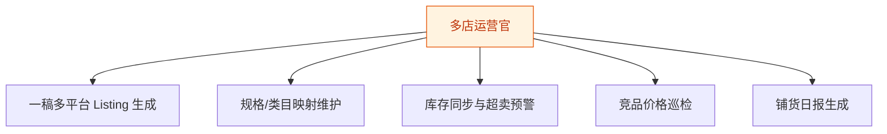

# 多店运营官 — 工作流流程图

本员工共 **5 条工作流**，下辖 **5 个原子技能**。

## 总览

## 分条详情

### 一稿多平台 Listing 生成

| 项目 | 内容 |
|------|------|
| 触发 | 人工 |
| 复杂度 | `M` |
| 阶段 | `P1` |
| ROI | 月省铺货 20h≈¥600 |

### 规格/类目映射维护

| 项目 | 内容 |
|------|------|
| 触发 | 人工（每月） |
| 复杂度 | `S` |
| 阶段 | `P1` |
| ROI | 一次维护多店复用 |

### 库存同步与超卖预警

| 项目 | 内容 |
|------|------|
| 触发 | 定时（每 15 分钟） |
| 复杂度 | `L` |
| 阶段 | `P1` |
| ROI | 一次超卖事故损失＞年费 |

### 竞品价格巡检

| 项目 | 内容 |
|------|------|
| 触发 | 定时（每日） |
| 复杂度 | `M` |
| 阶段 | `P1` |
| ROI | 跟价决策提速，守住毛利 |

### 铺货日报生成

| 项目 | 内容 |
|------|------|
| 触发 | 定时（每日 21:00） |
| 复杂度 | `S` |
| 阶段 | `P2` |
| ROI | 月省统计 6h≈¥180 |

## 汇总表

| # | 工作流 | 阶段 | 复杂度 | 触发 | 涉及技能数 |
|---|--------|------|--------|------|-----------|
| 1 | 一稿多平台 Listing 生成 | `P1` | `M` | 人工 | 2 |
| 2 | 规格/类目映射维护 | `P1` | `S` | 人工（每月） | 1 |
| 3 | 库存同步与超卖预警 | `P1` | `L` | 定时（每 15 分钟） | 2 |
| 4 | 竞品价格巡检 | `P1` | `M` | 定时（每日） | 1 |
| 5 | 铺货日报生成 | `P2` | `S` | 定时（每日 21:00） | 1 |

---

*本图由 build_p0_assets.py 自动生成*
