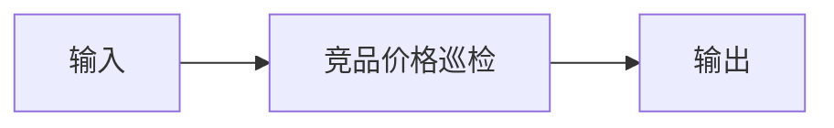

# 竞品价格巡检

## 元信息

| 字段 | 值 |
|------|-----|
| ID | `de_ecom_04_wf04` |
| 类型 | **`composite`（复合技能）** |
| 所属员工 | 多店运营官 |
| 阶段 | `P1` |
| 复杂度 | `M` |
| 触发方式 | 定时（每日） |
| ROI | 跟价决策提速，守住毛利 |
| 资产形态 | 提示词编排 + Python 编排脚本（无模型调用、无 API Key） |

> 复合技能 = 工作流。它把多个**原子技能**按业务顺序编排在一起，完成一个完整场景。

## 能力描述

竞品价格巡检端到端编排：竞品链接 → 价格/促销快照 → 异动判定 → 异动提醒。

1. **S1 快照结构化** —— 每个 SKU 的今日到手价/促销标记/7 日均价入表；SKU ≤ 50 个，缺价格即中止索要
2. **S2 价格巡检** —— 偏离 =（当前价 - 7日均价）÷ 7日均价 × 100%；下浮 ≥ 8% 高、5%~8% 中、上浮 ≥ 8% 中、±5% 内正常；大促标记一律附加人工确认
3. **S3 异动提醒** —— 高级别处置窗口「2 小时内核价」、中级别「今日复盘」，带未命中项计数

`scripts/run_flow.py` 承担 S1-S3 确定性部分，每步读取上一步产物。

## 编排的原子技能

| # | 原子技能 | 能力 |
|---|---------|------|
| 1 | [竞品价格巡检](../../skills/competitor-price-patrol/) | 竞品价格/促销异动检测 |

## 步骤链路（DAG）



## 步骤明细

| # | 步骤 | 技能资产 | 输入 | 输出 | 失败处理 |
|---|------|---------|------|------|---------|
| 1 | 竞品价格巡检 | [`../../skills/competitor-price-patrol/`](../../skills/competitor-price-patrol/) | 上一步输出 | 竞品价格巡检 输出 | 记录错误并中止 |

## 步骤说明

竞品链接→价格/促销→异动提醒

## 输入规格

| 字段 | 类型 | 必填 | 说明 |
|------|------|------|------|
| `input` | string / object | ✅ | 工作流初始输入，由触发条件提供 |

## 输出规格

| 字段 | 类型 | 说明 |
|------|------|------|
| `summary` | string | 执行摘要 |
| `steps` | string | 分步结果 |
| `deliverable` | string | 最终交付物 |

## 错误处理

| 情况 | 处理方式 |
|------|---------|
| 输入缺失 | 提示缺少的字段，终止流程 |
| 中间步骤输出不合规 | 合规技能拦截，返回修改建议，不继续下游 |
| 提示词被平台截断 | 拆分任务，分两次处理 |

## 验收标准

- [ ] 每一步的技能资产齐全（SKILL.md / prompt.txt / schema.json）
- [ ] 步骤间输入输出字段可衔接
- [ ] 末步输出带 AI 生成标识
- [ ] 全流程有人工确认环节

## 在平台上的编排方式

| 平台 | 编排方式 |
|------|---------|
| **Coze / 扣子** | 新建工作流 → 按步骤添加节点，每个节点填入对应技能的 prompt.txt |
| **Dify** | 新建 Workflow → 添加 LLM 节点链，按 DAG 顺序连接 |
| **WorkBuddy** | 新建 Skill，按步骤在指令中串联各技能提示词 |
| **手动使用** | 按步骤顺序，逐个把 prompt.txt 与上一步输出交给 AI |

## 使用示例

```text
第 1 步：把「竞品价格巡检」的 prompt.txt 粘贴到 AI，
         提供输入数据，得到输出 A。

第 2 步：把「下一技能」的 prompt.txt 粘贴到新的对话，
         把输出 A 作为输入，得到输出 B。

…依次类推，直到末步。
```

## 使用步骤

### 方式一：纯提示词编排（跨平台）

1. 把 `prompt.txt` 全文粘贴为系统提示词
2. 按「输入规格」提供工作流初始输入
3. 按执行步骤逐节点推进，每步对照量化验收标准
4. 数值判定以脚本实测为准，不靠模型口算

### 方式二：带脚本（端到端产物）

```bash
python <WF_DIR>/scripts/run_flow.py --input examples/input.json --outdir out
python <WF_DIR>/scripts/run_flow.py --demo      # 无输入也能看效果
```

| 平台 | 编排方式 |
|------|---------|
| **Coze / 扣子** | 工作流节点填各原子技能 prompt.txt，计算步用代码节点跑 run_flow.py |
| **Dify** | Workflow → LLM 节点链 + 代码节点 |
| **WorkBuddy** | 新建 Skill，按步骤在指令中串联各技能提示词 |
| **手动使用** | 按步骤顺序，逐个把 prompt.txt 与上一步输出交给 AI |

### 方式三：在主流平台导入（纯提示词）

| 平台 | 导入方式 |
|------|---------|
| **Coze / 扣子** | 新建 Bot → 人设与回复逻辑 → 粘贴 `prompt.txt` |
| **WorkBuddy** | 新建 Skill → 填入 `prompt.txt` 内容 |
| **Dify** | 新建应用 → 提示词编排 → 粘贴 `prompt.txt` |

## 边界（不做的事）

- ❌ 不跳过验收标准交付——「差不多」不算通过
- ❌ 不用模型口算替代脚本判定——偏离率/净可用/字数以脚本实数为准
- ❌ 不编造数据——缺失时列清单索要，不估算、不补零
- ❌ 不执行绕过平台规则的操作，不爬取需登录的私域数据
- ❌ 不代替用户做最终经营决策

## 调用示例

**输入**（`examples/input.json`）：2026-10-08 每日巡检定时任务，
云澜家居专营店 3 个监控 SKU（竞品A 限时直降 69.9 元/均价 82.5 元等）。

**输出**（脚本实跑）：异动 2 条（均为高级别降价）、需人工确认 2 条
（限时直降 + 百亿补贴标记）。预警清单 CSV + 异动提醒 MD 落盘 `out/`。

## 所属工作流

- 下游可接「铺货日报生成」（本仓 `distribution-daily-report-flow`），
  把巡检结果并入每日价格对比板块。

## 合规声明

- 输出标注「AI 生成内容」；推送前必须经运营人工复核
- 竞品数据只使用平台公开展示页或用户自行采集的数据，不爬取需登录的私域数据
- 巡检结果含商业敏感信息，不对外披露；不代替用户做跟价决策
---

*本复合技能定义由 build_p0_assets.py 生成*
